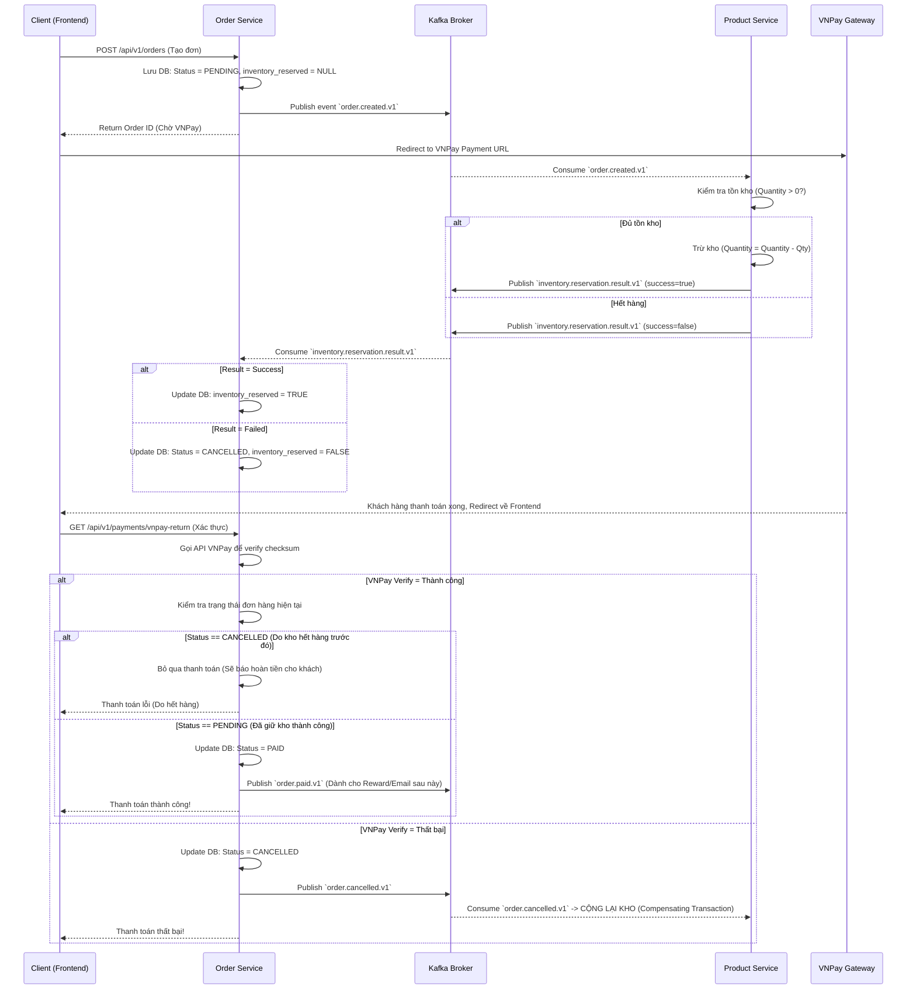

# Luồng Checkout bằng Saga Pattern & Kafka (End-to-End)

Dưới đây là luồng hoạt động chi tiết 100% của hệ thống khi một khách hàng bấm nút **"Thanh toán"** (VNPay). Hệ thống sử dụng **Choreography Saga Pattern** (các service tự giao tiếp với nhau qua event) thông qua Kafka.

## Biểu đồ tuần tự (Sequence Diagram)

---

## Giải thích chi tiết theo 4 Giai đoạn

### Giai đoạn 1: Khởi tạo (Order Service)
1. Bạn bấm "Thanh toán" trên UI. Frontend gọi API tạo đơn xuống `order-service`.
2. `order-service` lưu đơn hàng vào MySQL với trạng thái **`PENDING`** và cột `inventory_reserved = NULL` (chưa biết giữ kho được không).
3. `order-service` "hét lên" Kafka (Topic: `order.created.v1`): *"Có đơn hàng số 61 vừa tạo, gồm 2 áo thun size M!"*.
4. `order-service` trả về link VNPay cho Frontend để chuyển hướng bạn đi thanh toán.

### Giai đoạn 2: Giữ kho (Product Service)
1. Trong lúc bạn đang mải mê nhập mã OTP bên trang VNPay, thì ở backend, `product-service` nghe thấy tiếng gọi từ Topic `order.created.v1`.
2. Nó lôi dữ liệu ra, check MySQL Product DB xem "Áo thun size M" còn đủ 2 cái không.
   * **Nếu đủ:** Nó **trừ luôn kho** (quantity = quantity - 2) và hét lên Kafka (Topic: `inventory.reservation.result.v1`): *"Đơn 61 giữ kho THÀNH CÔNG!"*
   * **Nếu hết:** Nó hét lên Kafka: *"Đơn 61 giữ kho THẤT BẠI!"*

### Giai đoạn 3: Cập nhật cờ giữ kho (Order Service)
1. `order-service` nghe kết quả từ kho (Topic: `inventory.reservation.result.v1`).
   * **Nếu kho báo Thành công:** Nó cập nhật `inventory_reserved = TRUE`. Đơn hàng vẫn giữ nguyên trạng thái `PENDING` chờ bạn thanh toán xong.
   * **Nếu kho báo Thất bại:** Nó lập tức hủy đơn: `Status = CANCELLED`, `inventory_reserved = FALSE`.

### Giai đoạn 4: Hoàn tất thanh toán (VNPay -> Order Service)
1. Bạn nhập OTP xong, VNPay trừ tiền và văng bạn về lại web Frontend.
2. Frontend cầm các tham số (vnp_TxnRef, vnp_ResponseCode...) gọi về `order-service` để xác thực chữ ký (checksum) xem có đúng tiền đã vào tài khoản chưa.
3. Nếu **VNPay báo thành công**, `order-service` sẽ làm 1 bước kiểm tra sinh tử (Race-condition check):
   * Nó check xem đơn hàng này đang ở status nào.
   * Nếu đơn đã bị **`CANCELLED`** (ở Giai đoạn 3 do kho báo hết hàng): Nó sẽ từ chối ghi nhận thanh toán (in ra log `Payment result ignored for terminal orderId=...`). Ở thực tế, nhân viên CSKH sẽ nhìn thấy tiền thừa này và thực hiện hoàn tiền (Refund) cho khách.
   * Nếu đơn vẫn là **`PENDING`** (và `inventory_reserved = TRUE`): Chúc mừng! `order-service` cập nhật đơn thành **`PAID`**.
4. (Tuỳ chọn) Sau khi `PAID`, nó có thể bắn tiếp 1 event `order.paid.v1` để các service khác (như Promotion cộng điểm, Notification gửi email) chạy ngầm.

### Compesating Transaction (Giao dịch bù trừ)
Nếu ở Giai đoạn 4, VNPay báo thanh toán thất bại (do bạn hủy ngang, không nhập mã OTP), `order-service` sẽ:
1. Đổi Status = **`CANCELLED`**
2. Bắn event `order.cancelled.v1`
3. Lúc này `product-service` nghe thấy, nó nhận ra *"Ôi khách hủy rồi, nãy mình lỡ trừ 2 cái áo thun rồi"*. Nó sẽ thực hiện **Hành động bù trừ (Compensating)**: Cộng lại 2 cái áo thun vào kho để người khác mua.
